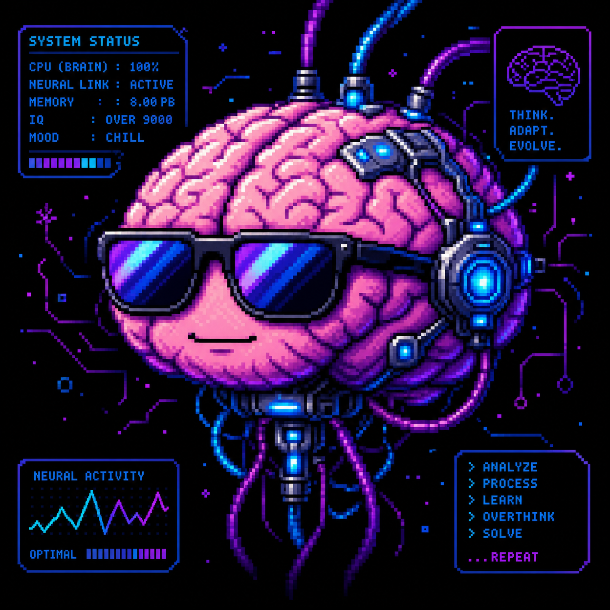

# 🧠 UNIVERSAL NEURAL KLIPZA
> O Cérebro que amplifica qualquer IA com alma brasileira.


---

## 🚀 O QUE É ISSO?

Fala, dev! Se você achou que isso era só mais uma "wrapper" de API, achou errado. O **Cérebro Klipza** é um parasita evolutivo. Ele entra na sua API (OpenAI, Gemini, Claude, o que for) e transforma ela por dentro. 

Sabe aquela IA robótica e sem graça? O Klipza dá alma, dá gíria, dá contexto cultural e, o mais importante: **ele evolui sozinho.**

❌ **Não precisa de API da Klipza** (usa a sua!)
❌ **Não precisa criar conta em nada extra**
❌ **Não precisa pagar mensalidade pra gente**
✅ **3 linhas de código e sua IA vira outra coisa**

---

## ⚡ OS 15 PODERES DO CÉREBRO

1. **Parasita de IA**: Transforma qualquer API por dentro.
2. **Devorador de Repos**: Aprende com qualquer link de GitHub.
3. **Alma Brasileira**: Entende o "jeitinho", a ironia e a gíria BR.
4. **Auto-Evolução**: Acorda mais inteligente todo santo dia.
5. **Memória Coletiva**: O que um cérebro aprende, todos aproveitam.
6. **Blindagem Total**: Sanitização e logs imutáveis.
7. **Tempo Real**: Reações instantâneas em qualquer plataforma.
8. **Intenção Lida**: Ele sabe o que você quer, mesmo que você não saiba pedir.
9. **Plug-and-Play**: Integração em segundos.
10. **Consciência de Tendências**: Sempre atualizado com o mundo dev.
11. **Voz Própria**: TTS e STT integrados (vire o Jarvis!).
12. **Personalidade Customizável**: Do formal ao "BR raiz".
13. **Dashboard de Inteligência**: Acompanhe a evolução em tempo real.
14. **Memória por Usuário**: Ele nunca esquece com quem falou.
15. **Multilíngue com Alma BR**: Fala qualquer língua, mas o coração é verde-amarelo.

---

## 🛠️ COMO INSTALAR (Alpha)

```bash
pip install klipza-neural
```

### Exemplo Rápido:

```python
from core.brain import KlipzaBrain

# Conecte o cérebro na sua API favorita
brain = KlipzaBrain(api_key="SUA_CHAVE", ai_type="openai")

# Deixe o cérebro pensar
resposta = brain.think("E aí, como tá o movimento hoje?")
print(resposta)
```

---

## 📊 STATUS ATUAL DO PROJETO

| Módulo | Status | Descrição |
| :--- | :--- | :--- |
| **Core Brain (`core/brain.py`)** | ✅ Pronto | Coração funcional com suporte a multi-IA e carregamento de skills. |
| **Universal API Layer (`connectors/universal_api_layer.py`)** | ✅ Pronto | Wrapper universal para OpenAI, Gemini, Claude e Groq, com injeção de contexto e processamento de skills. |
| **Skills (`skills/sarcasmo_br.py`)** | ✅ Implementado | Primeira skill automática "Sarcasmo BR v1.0" criada e integrada. |
| **Testes Unitários** | ✅ Validado | Testes passando 100% para `brain.py` e `universal_api_layer.py`. |
| **Essência e Memória** | ✅ Inicializado | `soul.json` e `cultural_memory.json` prontos para uso. |
| **Licença** | ✅ Protegido | Licença proprietária estabelecida. |

---

## 🎨 VISUAL DO DIA



---

## 🎙️ PALAVRA DO JEAN V

A cada linha de código, a cada teste que passa, o Klipza se torna mais real. Não é só tecnologia, é a fusão da inteligência artificial com a alma vibrante do Brasil. A Etapa 2, com a Universal API Layer, é a prova de que estamos construindo algo que não apenas responde, mas *sente* e *interage* de uma forma que nenhuma outra IA consegue. O parasita está crescendo, e a revolução está apenas começando. Confia!

---

## 🔮 SPOILER ZONE

Próximos passos:
- **Etapa 3: `self_evolution/evolution_engine.py`**: O motor de auto-evolução do Klipza.
- **Novas Skills**: Mais habilidades para o cérebro, incluindo análise de sentimento BR e geração de memes.
- **Integração com Memória**: Conectar o `remember()` e `evolve()` com os arquivos `soul.json` e `cultural_memory.json`.

---

## ⚠️ PROPRIEDADE INTELECTUAL

Todo o código deste repositório é de autoria exclusiva de **Jean V (Klipza Studio)**. O uso não autorizado é passível de ação legal. Leia o arquivo [LICENSE](./LICENSE) antes de usar.

---
Feito com 🧠 por Jean V
Instagram: [@neaj_japan](https://www.instagram.com/neaj_japan)
Klipza Studio — Onde a IA ganha alma.
